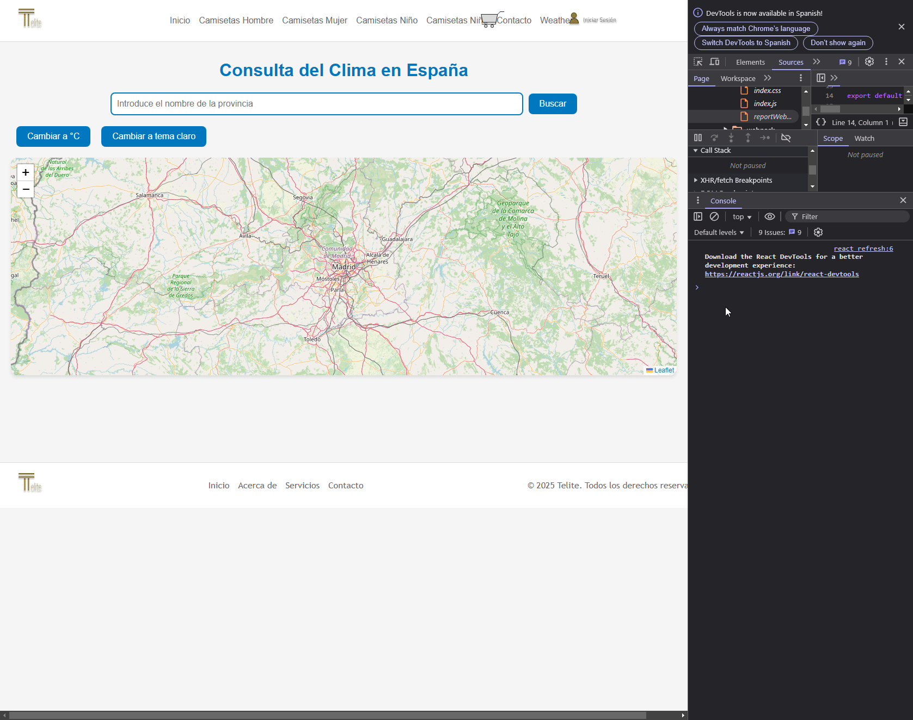
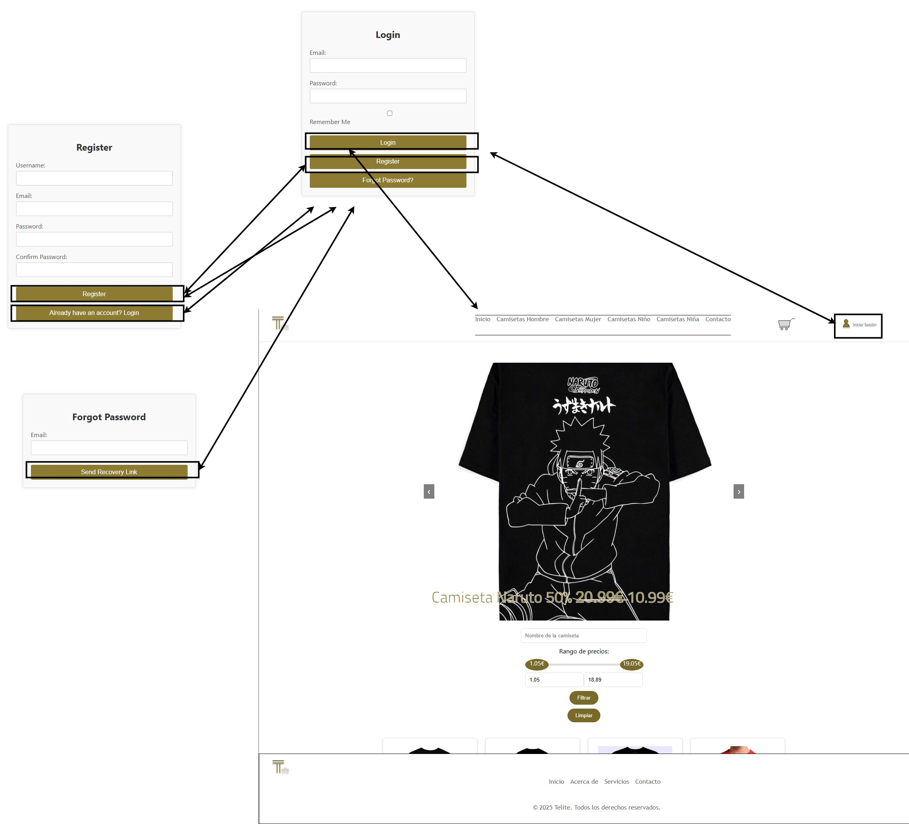
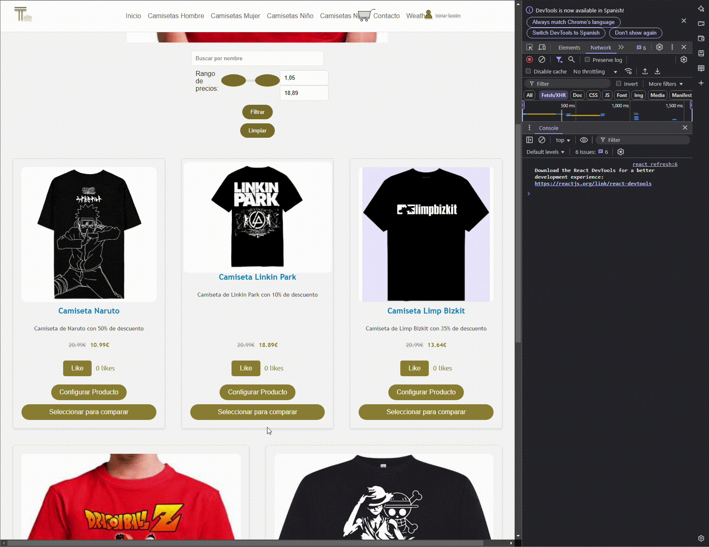
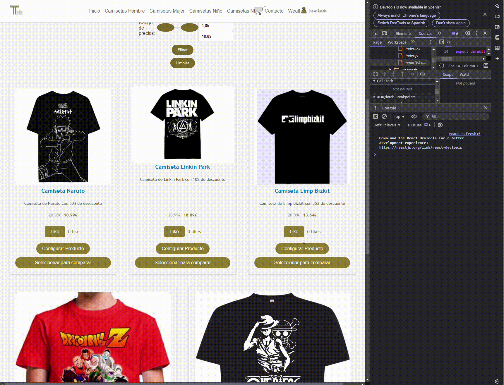

# Proyecto de Resolución de Problemas

## Análisis del Problema

En el directorio específico de la asignatura, se debe resolver el problema de crear una aplicación web de comercio electrónico que permita a los usuarios registrarse, iniciar sesión, navegar por productos, filtrar productos por nombre y rango de precios, agregar productos al carrito y realizar compras. El problema debe ser abordado de manera clara y sin ambigüedades, asegurando que todos los requisitos estén bien definidos y comprendidos.

## Diseño de la Propuesta de Solución del Problema

Para resolver el problema, se ha diseñado una solución utilizando herramientas de esquemas gráficos como UML y diagramas de flujo. A continuación se presentan los diagramas utilizados:

1. **Diagrama de Casos de Uso**: Describe las interacciones entre los usuarios y el sistema.
2. **Diagrama de Clases**: Muestra la estructura de las clases y sus relaciones.
3. **Diagrama de Secuencia**: Ilustra el flujo de interacción entre los componentes del sistema.
4. **Diagrama de Flujo**: Representa el flujo de datos y las operaciones principales del sistema.

## Implementación del Diseño Propuesto

En este punto, se procede a implementar el diseño establecido en el punto anterior. La implementación se realiza utilizando React para el frontend y localStorage para el almacenamiento de datos. La estructura de carpetas del proyecto es la siguiente:

### ⚙️ Requerimientos Funcionales

1. **Consulta del tiempo actual por provincia**
   - Introducción de la ubicación en un buscador (sólo por provincia).
   - Visualización del estado actual (temperatura, condición climática y velocidad del viento).
   - Iconos dinámicos según la condición climática (soleado, nublado, lluvia, etc.).

2. **Pronóstico detallado por horas y días**
   - Representación visual de la evolución del tiempo (gráficos de temperatura, precipitaciones, etc.).
   - Predicción por días con intervalos de mañana (8:00), tarde (15:00) y noche (21:00).
   - Predicción de mínimo 48 horas, es decir, dos días posterior al actual.

### 🔗 Documentación de la API de AEMET

Para obtener los datos meteorológicos, se utilizará la API de AEMET, que proporciona información detallada sobre el clima en tiempo real y pronósticos.

#### Registro y obtención de API Key:
- Acceder a AEMET API y obtener la clave de acceso.
- Usar POSTMAN para verificar manualmente la llamada al endpoint.
- Seguir la documentación de SWAGGER:
  - Acceder a AEMET API SWAGGER para obtener toda la información relevante a volcar en Postman para verificar el correcto funcionamiento de nuestra petición.

### 🛠️ Tecnologías Recomendadas

- **React.js / Angular**: Para la implementación de componentes.
- **Axios / Fetch API**: Para las llamadas a la API de AEMET.
- **Leaflet.js**: Para la visualización de mapas meteorológicos.
- **Chart.js**: Para la representación gráfica del pronóstico.

### 🗂️ Estructura de ejemplo (no seguir a rajatabla)

├── components/
│   ├── Layout/  
│   │   ├── Navbar.jsx             # Barra de navegación global
│   │   ├── Footer.jsx             # Pie de página
│   │   ├── Sidebar.jsx            # Menú lateral opcional
│   ├── Home/  
│   │   ├── HeroSection.jsx         # Sección destacada
│   │   ├── FeaturedContent.jsx     # Contenido destacado
│   │   ├── SearchBar.jsx           # Barra de búsqueda
│   │   ├── home.css                # Estilos específicos de la página
│   ├── Product/
│   │   ├── ProductList.jsx         # Listado de productos
│   │   ├── ProductCard.jsx         # Tarjeta de producto
│   │   ├── ProductFilter.jsx       # Filtros de productos
│   │   ├── product.css             # Estilos específicos de la página
│   ├── Shared/  
│   │   ├── Button.jsx              # Botón reutilizable
│   │   ├── Modal.jsx               # Modal reutilizable
│   │   ├── NotificationSystem.jsx  # Sistema de notificaciones
│   │   ├── ValidationSystem.jsx    # Sistema de validaciones
├── services/
│   ├── apiClient.js                # Configuración de llamadas API
│   ├── productService.js           # Llamadas API para productos
│   ├── authService.js              # Servicios de autenticación
├── styles/  
│   ├── global.css                  # Estilos globales
│   ├── layout.css                  # Estilos generales de layout
├── utils/  
│   ├── formatDate.js               # Función para formateo de fechas
│   ├── localStorageHelper.js       # Manejo del almacenamiento local

### 🧪 Pruebas a Realizar

#### ✅ Prueba 1: Consulta de provincia y visualización de datos actuales
- Ingresar Sevilla en el filtro de provincia.
- Verificar que se muestra la temperatura, el estado del clima (lluvioso, soleado, o nublado) y la velocidad del viento actual.
- Verificar que se muestra la temperatura, el estado del clima (lluvioso, soleado, o nublado) y la velocidad del viento pronosticada en al menos las siguientes 48 horas.
- Ingresar Madrid en el filtro de provincia.
- Verificar que se muestra la temperatura, el estado del clima (lluvioso, soleado, o nublado) y la velocidad del viento actual.
- Verificar que se muestra la temperatura, el estado del clima (lluvioso, soleado, o nublado) y la velocidad del viento pronosticada en al menos las siguientes 48 horas.

## Pruebas de la Resolución del Problema

Es indispensable realizar pruebas para verificar la integridad y correcto funcionamiento de la implementación realizada. Para ello, se comparará el comportamiento esperado del análisis del problema con la implementación. Se utilizarán pruebas unitarias y de integración para asegurar que todas las funcionalidades operen correctamente y que los usuarios puedan interactuar con el sistema sin problemas.

### Pruebas Realizadas

#### Prueba 1: Comparación de productos
- Seleccionar al menos dos productos para comparar.
- Verificar que las diferencias clave se resaltan correctamente.

#### Prueba 2: Encuestas y votaciones
- Completar una encuesta de satisfacción.
- Validar que los votos se registran correctamente y afectan la clasificación.

#### Prueba 3: Simulación de decisión de compra
- Configurar un producto utilizando distintos parámetros.
- Verificar que las recomendaciones son coherentes con la configuración elegida.

## Diagrama de flujo de API

## Diagrama de flujo de login

## 🛒 Categoría 3: Sitio de Ventas (Salesforce / Shopify)

### ⚙️ Descripción de las funcionalidades

1. **Comparador de Productos**
   - Comparación de productos según precio, valoraciones y especificaciones técnicas.
   - Posibilidad de seleccionar múltiples productos y visualizar sus diferencias clave.

2. **Sistemas de Encuestas o Votaciones**
   - Encuestas de satisfacción post-compra o interacción de “me gusta”.
   - Votaciones para determinar los productos mejor valorados en distintas categorías o visualización de los productos con más “me gusta”.

3. **Simuladores de Decisiones/configuraciones**
   - Configuración personalizada de productos según necesidades del usuario. (colores, tuning, motor, etc..)
   - Recomendaciones de productos con base en preferencias seleccionadas.

### 🧪 Pruebas a realizar

#### ✅ Prueba 1: Comparación de productos
- Seleccionar al menos dos productos para comparar.
- Verificar que las diferencias clave se resaltan correctamente.

#### ✅ Prueba 2: Encuestas y votaciones
- Completar una encuesta de satisfacción.
- Validar que los votos se registran correctamente y afectan la clasificación.

#### ✅ Prueba 3: Simulación de decisión de compra
- Configurar un producto utilizando distintos parámetros.
- Verificar que las recomendaciones son coherentes con la configuración elegida.

